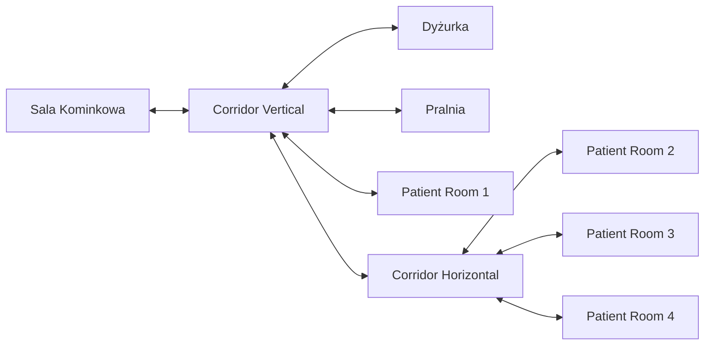

# Dokumentacja: Plan Parteru Detox

## 1. Status dokumentu
- **Scena źródłowa:** `Assets/_Project/Scenes/DetoxPrototype.unity`
- **Data przygotowania raportu:** 13.06.2026
- **Status modelu:** Dokument opisuje aktualny stan geometrii (greybox).
- **Zastrzeżenie:** Geometria pomieszczeń może jeszcze ewoluować.
- **Zasada skali:** 1 jednostka Unity = 1 metr.

## 2. Hierarchia sceny
Aktualne drzewo obiektów w kontenerze `Environment/Rooms`:
- `Rooms`
  - `Shared Walls`
    - `Wall_R2_R3_Shared`
    - `Wall_R3_R4_Shared`
  - `Detox Common Room`
    - `Floor`
    - `Walls`
  - `Corridor Vertical`
    - `Floor`
    - `Walls`
  - `Corridor Horizontal`
    - `Floor`
    - `Walls`
  - `Nurse Station`
    - `Floor`
    - `Walls`
  - `Laundry`
    - `Floor`
    - `Walls`
  - `Patient Room 1`
    - `Floor`
    - `Walls`
  - `Patient Room 2`
    - `Floor`
    - `Walls`
  - `Patient Room 3`
    - `Floor`
    - `Walls`
  - `Patient Room 4`
    - `Floor`
    - `Walls`

## 3. Tabela pomieszczeń

| Nazwa | Pełna ścieżka | Pozycja kontenera (Lokalna) | Pozycja podłogi (Lokalnie wzg. kontenera) | Wynikowa pozycja w `Rooms` | Skala podłogi (X × Z) | Przybliżony wymiar użytkowy (m) | Przybliżona powierzchnia (m²) | Liczba przypisanych ścian | Sąsiadujące strefy |
| :--- | :--- | :--- | :--- | :--- | :--- | :--- | :--- | :--- | :--- |
| Detox Common Room | `Environment/Rooms/Detox Common Room` | `(0.00, 0.00, -0.14)` | `(-4.59, 0.02, -6.62)` | `(-4.59, 0.02, -6.76)` | `(14.00, 14.00)` | 14.0 × 14.0 | ~196.0 | 6 | Corridor Vertical |
| Corridor Vertical | `Environment/Rooms/Corridor Vertical` | `(0.00, 0.00, 0.00)` | `(-2.39, 0.02, 5.23)` | `(-2.39, 0.02, 5.23)` | `(2.98, 10.00)` | 2.98 × 10.0 | ~29.8 | 4 | Sala Kominkowa, Nurse Station, Laundry, R1, Corridor Horizontal |
| Corridor Horizontal | `Environment/Rooms/Corridor Horizontal` | `(0.00, 0.00, 0.00)` | `(6.71, 0.02, 9.39)` | `(6.71, 0.02, 9.39)` | `(16.00, 2.00)` | 16.0 × 2.0 | ~32.0 | 2 | Corridor Vertical, R2, R3, R4 |
| Nurse Station | `Environment/Rooms/Nurse Station` | `(-0.20, 0.00, 0.00)` | `(-6.77, 0.02, 4.09)` | `(-6.97, 0.02, 4.09)` | `(7.00, 5.00)` | 7.0 × 5.0 | ~35.0 | 5 | Corridor Vertical |
| Laundry | `Environment/Rooms/Laundry` | `(0.33, 0.00, 0.00)` | `(1.60, 0.02, 4.08)` | `(1.93, 0.02, 4.08)` | `(6.00, 5.00)` | 6.0 × 5.0 | ~30.0 | 5 | Corridor Vertical |
| Patient Room 1 | `Environment/Rooms/Patient Room 1` | `(-0.20, 0.00, 0.00)` | `(-6.27, 0.02, 10.78)` | `(-6.47, 0.02, 10.78)` | `(6.00, 6.00)` | 6.0 × 6.0 | ~36.0 | 5 | Corridor Vertical |
| Patient Room 2 | `Environment/Rooms/Patient Room 2` | `(0.00, 0.00, 0.00)` | `(0.40, 0.02, 12.85)` | `(0.40, 0.02, 12.85)` | `(6.00, 5.00)` | 6.0 × 5.0 | ~30.0 | 4 | Corridor Horizontal, R3 |
| Patient Room 3 | `Environment/Rooms/Patient Room 3` | `(0.00, 0.00, 0.00)` | `(6.37, 0.02, 12.84)` | `(6.37, 0.02, 12.84)` | `(6.00, 5.00)` | 6.0 × 5.0 | ~30.0 | 3 | Corridor Horizontal, R2, R4 |
| Patient Room 4 | `Environment/Rooms/Patient Room 4` | `(0.00, 0.00, 0.00)` | `(13.15, 0.02, 12.86)` | `(13.15, 0.02, 12.86)` | `(8.00, 5.00)` | 8.0 × 5.0 | ~40.0 | 4 | Corridor Horizontal, R3 |

*Uwaga: Wymiary (X × Z) odczytano ze skali obiektów podłogi. Powierzchnie wynikają bezpośrednio z wymiarów greyboxowych podłóg i nie są jeszcze końcowymi powierzchniami użytkowymi po uwzględnieniu ścian oraz wyposażenia.*

## 4. Połączenia komunikacyjne

Poniższe informacje bazują na wymiarach segmentów ścian, które tworzą wejścia do poszczególnych stref (brak fizycznych modeli drzwi).

- **Sala Kominkowa ↔ Corridor Vertical**
  - Otwór stworzony pomiędzy `Wall_SK_Front_Left` a `Wall_SK_Front_Right`.
  - Otwór ma ok. 1.2 m szerokości.
  - Fizyczny obiekt drzwi: **Brak**.
- **Corridor Vertical ↔ Corridor Horizontal**
  - Przejście powstaje na styku obu korytarzy, szerokość przejścia wynosi ok. 2-3 m.
  - Fizyczny obiekt drzwi: **Brak**.
- **Corridor Vertical ↔ Nurse Station**
  - Otwór pomiędzy `Wall_NS_Entrance_Left` a `Wall_NS_Entrance_Right`.
  - Szerokość: ok. 1.2 m.
  - Fizyczny obiekt drzwi: **Brak**.
- **Corridor Vertical ↔ Laundry**
  - Otwór pomiędzy `Wall_Laundry_Entrance_Left` a `Wall_Laundry_Entrance_Right`.
  - Szerokość: ok. 1.2 m.
  - Fizyczny obiekt drzwi: **Brak**.
- **Corridor Vertical ↔ Patient Room 1**
  - Otwór pomiędzy `Wall_R1_Entrance_Left` a `Wall_R1_Entrance_Right`.
  - Szerokość: ok. 1.2 m.
  - Fizyczny obiekt drzwi: **Brak**.
- **Corridor Horizontal ↔ Patient Room 2**
  - Otwór pomiędzy `Wall_R2_Entrance_Left` a `Wall_R2_Entrance_Right`.
  - Szerokość: ok. 1.3 m.
  - Fizyczny obiekt drzwi: **Brak**.
- **Corridor Horizontal ↔ Patient Room 3**
  - Otwór pomiędzy `Wall_R3_Entrance_Left` a `Wall_R3_Entrance_Right`.
  - Szerokość: ok. 1.5 m.
  - Fizyczny obiekt drzwi: **Brak**.
- **Corridor Horizontal ↔ Patient Room 4**
  - Otwór pomiędzy `Wall_R4_Entrance_Left` a `Wall_R4_Entrance_Right`.
  - Szerokość: ok. 1.3 m.
  - Fizyczny obiekt drzwi: **Brak**.

Szerokości otworów odzwierciedlają aktualny greybox po ręcznych korektach. Docelowy standard szerokości drzwi nie został jeszcze zatwierdzony.

## 5. Ściany wspólne

- Ściany rozdzielające pokoje: `Wall_R2_R3_Shared` oraz `Wall_R3_R4_Shared`
- **Aktualny rodzic:** Znajdują się w dedykowanym kontenerze `Shared Walls` wewnątrz `Rooms`.
- **Dlaczego pozostają poza kontenerami pokojów:** Ściany wspólne są używane przez więcej niż jedno pomieszczenie, więc przypisanie ich tylko do jednego z nich doprowadziłoby do ich utraty w drugim w razie modyfikacji, co utrudniałoby modularne układanie pokoi.
- **Konsekwencja ręcznego przesuwania R2–R4:** Jeśli kontener pojedynczego pokoju zostanie przesunięty (co zdarzyło się w scenie), wspólne ściany nie przemieszczają się automatycznie. Zmiana położenia pokoi będzie w związku z tym wymagać osobnej ręcznej korekty położenia ścian w `Shared Walls`.

## 6. Schemat funkcjonalny

Poniższy schemat przestawia logiczny przepływ pomiędzy głównymi strefami Detoxu na parterze:

## 7. Funkcja pomieszczeń

- **Sala Kominkowa:** Miejsce przeznaczone na czas wolny pacjentów. Według regulaminu znajduje się tutaj radio i od 15:30 dostępny jest pilot do TV.
- **Dyżurka (Nurse Station):** Miejsce pracy personelu medycznego. O 09:00 i 15:00 wydawane są stąd leki, a po posiłkach formuje się tutaj kolejka do okienka po kawę.
- **Pralnia (Laundry):** Strefa zapewniająca niezbędną obsługę logistyczną odzieży/pościeli w obrębie Detoxu.
- **Patient Room 1–4:** Pokoje przeznaczone dla pacjentów Detoxu. Dokładna liczba łóżek i pojemność poszczególnych pokoi nie zostały jeszcze ustalone.
- **Korytarze (Vertical, Horizontal):** Główne szlaki komunikacyjne łączące pokoje z Salą Kominkową oraz Dyżurką.

## 8. Elementy planowane, ale jeszcze niewykonane

Zarówno w dokumentacji projektu (`README.md`), jak i logice pomieszczeń zakłada się powstanie poniższych elementów. **Żaden z nich nie znajduje się jeszcze w aktualnej scenie**:
- Taras przy Sali Kominkowej.
- Drzwi na kartę prowadzące z Sali Kominkowej na taras.
- Okna w wybranych pomieszczeniach, zgodnie z późniejszym projektem elewacji i układem funkcjonalnym.
- Właściwe (fizyczne) modele drzwi.
- Sprzęt i wyposażenie (łóżka, sprzęt medyczny, TV, meble w dyżurce itp.).
- Palarnia (wewnętrzna strefa dla Sali Kominkowej).
- System monitoringu i kamer.

## 9. Otwarte kwestie geometryczne

Podczas przeglądu geometrii zauważono kilka kwestii, które mogą wymagać poprawy:
- **Szczeliny i nakładanie:** Ponieważ ściany są tworzone z oddzielnych, prostych segmentów, które bywają pozycjonowane ze stałymi wymiarami (np. korytarze mogą nie zamykać się szczelnie po dołożeniu segmentu bocznego), na stykach mogą powstawać drobne z-fightingi lub nieszczelności.
- **Korytarze i ściany obrysowe:** Corridor Horizontal posiada dwie własne ściany, natomiast pozostałe granice jego przebiegu są częściowo tworzone przez ściany wejściowe sąsiednich pokoi. Układ należy później ponownie sprawdzić po dodaniu właściwych drzwi, ościeżnic i wykończeń.
- **Zależności z Shared Walls:** Odłączone ściany międzypokojowe (w `Shared Walls`) nie nadążają za modyfikacjami offsetu głównych pokojów R2–R4, dlatego przy każdych ewentualnych przesunięciach, konieczna będzie kontrola i poprawka offsetu ściany wewnątrz `Shared Walls`.

## 10. Zasady dalszej rozbudowy

- Podłoga (`Floor`) oraz dedykowane ściany (`Walls`) zawsze powinny być zgrupowane jako dzieci wewnątrz kontenera danego pomieszczenia.
- Każde przyszłe wyposażenie pomieszczeń powinno zostać zgrupowane w nowym, podrzędnym kontenerze `Furniture`.
- Wszystkie okna w pomieszczeniu powinny trafić do kontenera `Windows`.
- Analogicznie, przyszłe obiekty drzwi powinny trafiać do lokalnego kontenera `Doors`.
- Ściany wspólne między pokojami pozostają umieszczone oddzielnie w folderze `Shared Walls`, pod korzeniem `Rooms`.
- **Ważne:** Przed jakąkolwiek ręczną zmianą pozycji czy rotacji pojedynczego pomieszczenia, należy zawsze zweryfikować połączenia jego wejść z obrysem korytarza oraz wyrównanie `Shared Walls`.
